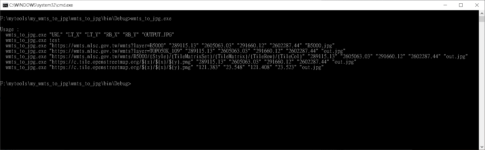
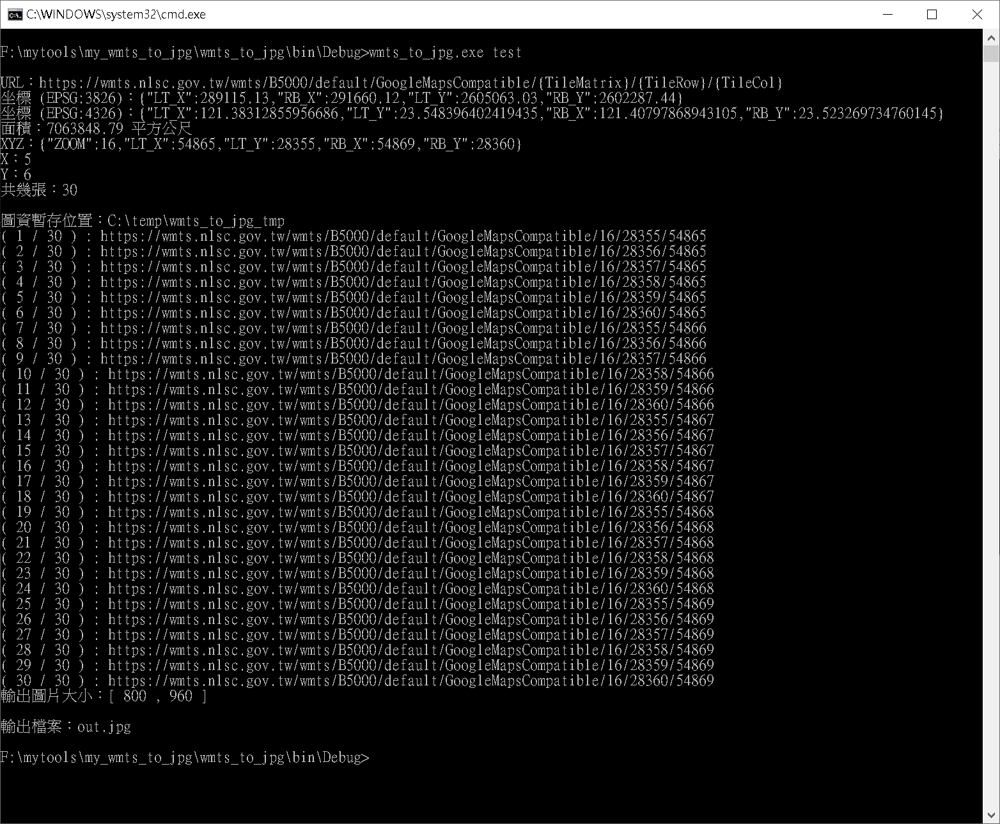
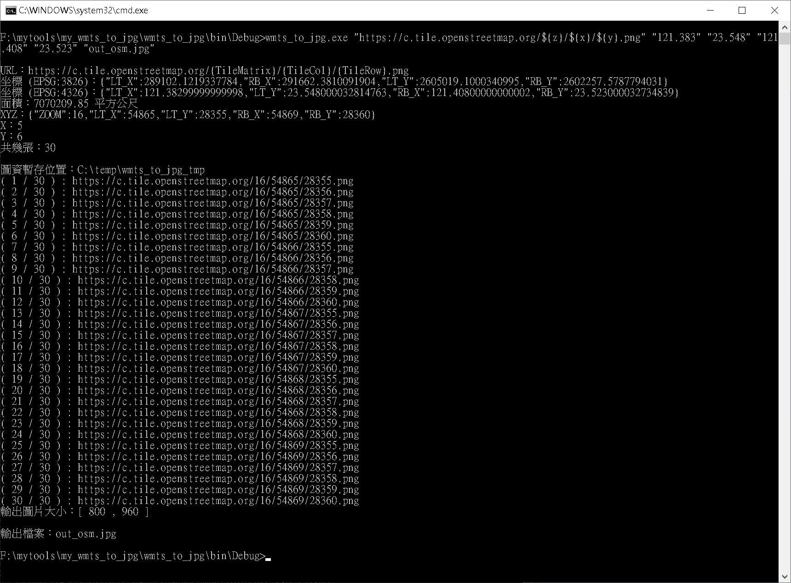
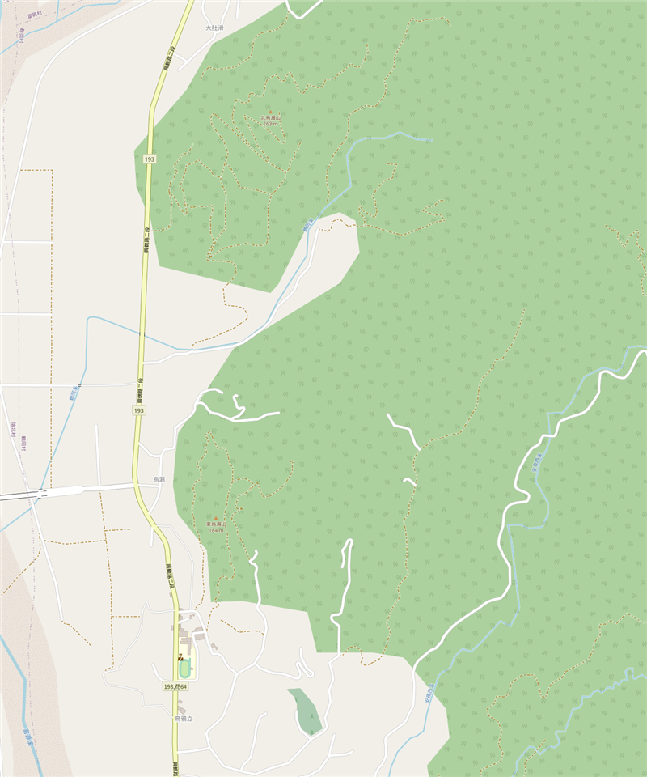

# my_wmts_to_jpg
將 wmts 第 16 階，指定的四角範圍坐標，轉成一張 jpg 縮圖，方便透過 wmts 製作型錄縮圖。

<h2>Author</h2>
羽山秋人 (https://3wa.tw)

<h2>License</h2>
MIT
 

<h2>程式執行</li>

wmts_to_jpg.exe [WMTS URL] [LT_X] [LT_Y] [RB_X] [RB_Y] [OUTPUT.JPG]

<h2>使用方法</h2>

<table border="1" cellpadding="0" cellspacing="0" style="padding:3px;">
<thead>
<tr>
    <th>項次</th>
    <th>名稱</th>
    <th>功能</th>
    <th>範例</th>
</th>
</thead>
<tbody>
<tr>
    <td>1</td>
    <td>WMTS URL</td>
    <td>傳入 WMTS 網址</td>
    <td>
https://c.tile.openstreetmap.org/${z}/${x}/${y}.png
或
https://c.tile.openstreetmap.org/{TileMatrix}/{TileCol}/{TileRow}.png
    </td>
</tr>
<tr>
    <td>2</td>
    <td>LT_X</td>
    <td>傳入 左上角 Longitude</td>
    <td>(WGS84) 121.383 或 (EPSG:3826) 289115.13</td>
</tr>    
<tr>
    <td>3</td>
    <td>LT_Y</td>
    <td>傳入 左上角 Latitude</td>
    <td>(WGS84) 23.548 或 (EPSG:3826) 2605063.03</td>
</tr>
<tr>
    <td>4</td>
    <td>RB_X</td>
    <td>傳入 右下角 Longitude</td>
    <td>(WGS84) 121.408 或 (EPSG:3826) 291660.12</td>
</tr>
<tr>
    <td>5</td>
    <td>RB_Y</td>
    <td>傳入 右下角 Latitude</td>
    <td>(WGS84) 23.523 或 (EPSG:3826) 2602287.44</td>
</tr>
<tr>
    <td>6</td>
    <td>OUTPUT.jpg</td>
    <td>輸出圖檔</td>
    <td>out.jpg 或 C:\temp\out.jpg</td>
</tr>
</tbody>
</table>

<h2>Usage:</h2>

wmts_to_jpg.exe

<h2>Usage：</h2>
  wmts_to_jpg.exe "URL" "LT_X" "LT_Y" "RB_X" "RB_Y" "OUTPUT.JPG"
  wmts_to_jpg.exe test
  wmts_to_jpg.exe "https://wmts.nlsc.gov.tw/wmts?layer=B5000" "289115.13" "2605063.03" "291660.12" "2602287.44" "B5000.jpg"
  wmts_to_jpg.exe "https://wmts.nlsc.gov.tw/wmts?layer=TOPO50K_109" "289115.13" "2605063.03" "291660.12" "2602287.44" "out.jpg"
  wmts_to_jpg.exe "https://wmts.nlsc.gov.tw/wmts/B5000/{Style}/{TileMatrixSet}/{TileMatrix}/{TileRow}/{TileCol}" "289115.13" "2605063.03" "291660.12" "2602287.44" "out.jpg"
  wmts_to_jpg.exe "https://c.tile.openstreetmap.org/${z}/${x}/${y}.png" "289115.13" "2605063.03" "291660.12" "2602287.44" "out.jpg"
  wmts_to_jpg.exe "https://c.tile.openstreetmap.org/${z}/${x}/${y}.png" "121.383" "23.548" "121.408" "23.523" "out.jpg"

<h2>設定檔參數：</h2>
wmts_to_jpg.exe.config
<!--輸出庫存的目錄-->
    <add key="tmp_path" value="C:\temp\wmts_to_jpg_tmp" />
    
<h2>縮圖參考：</h2>
  

    
    使用方法列表    
         
     
    
    Run test
         
     
    
    Osm 範例
         
     
    
    osm 輸出圖範例
     
    
  

Todo：
<ul>
  <li>1、參數改用 options</li>
  <li>2、wmts getcapabilities 改用 geo package</li>
  <li>3、自定傳入坐標系統類型</li>
  <li>4、合併圖資時，直接開計算後限制的大小，其他等比例縮放，減少記憶體使用</li>
</li>
